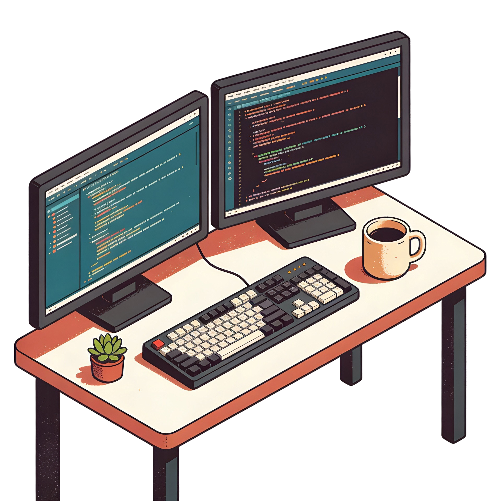

<h1 align="left">Marcio Samuel</h1>

  <strong>Frontend Engineer</strong> &nbsp;·&nbsp; React &nbsp;·&nbsp; React Native &nbsp;·&nbsp; Next.js &nbsp;·&nbsp; TypeScript

  Building products for web, mobile and Smart TV, with accessibility and performance in mind.

  <a href="https://marciosamuel.vercel.app/en"><strong>Portfolio and case studies</strong></a>

## About

Frontend engineer with **5+ years** shipping production applications across web, mobile and TV platforms. I work mainly with **React, React Native and Next.js**, from SSR/SSG and real-time features to cross-platform mobile apps and Smart TV apps for Samsung Tizen and LG webOS.

I also handle the layers around the UI: **Firebase** (Auth, Firestore, Storage, Rules), **two-factor authentication**, and integrations with services like Zoom and Twilio. I care about clean architecture, accessibility (WCAG), performance, and interfaces that hold up at scale.

- 🏢 &nbsp; Frontend Engineer at **[AppMasters](https://appmasters.io/)**, remote, since Sep 2021 (intern, then junior from Jan 2022, mid-level since Jan 2026)
- 📍 &nbsp; Guanambi, Bahia, Brazil
- 🎓 &nbsp; Technologist in Systems Analysis & Development, Instituto Federal Baiano, 2024
- 🌐 &nbsp; Portuguese (native) · English (B2, upper intermediate)

## Currently

- 🔨 &nbsp; Day-to-day: **React · React Native · Next.js · TypeScript · Firebase**
- 🧩 &nbsp; Recent work: an AI assistant platform for WhatsApp and Instagram, a wine platform on web, mobile and TV, and a finance platform for car dealerships. Details are in the [case studies](https://marciosamuel.vercel.app/en).
- 💬 &nbsp; Always open to a good conversation about interesting products

## Tech Stack

**Core** &nbsp;·&nbsp; React · React Native · Next.js · TypeScript · JavaScript (ES2022+) · Expo

**Styling & UI** &nbsp;·&nbsp; Tailwind CSS · Styled Components · Mantine · Ant Design · shadcn/ui · CSS

**State & Forms** &nbsp;·&nbsp; Zustand · React Context · React Hook Form

**Data** &nbsp;·&nbsp; GraphQL · Apollo · REST APIs

**Backend & Infra** &nbsp;·&nbsp; Firebase (Auth · Firestore · Storage · Rules) · Node.js · Vercel

**Integrations** &nbsp;·&nbsp; Twilio · Zoom SDK · Google Maps

**Mobile & TV** &nbsp;·&nbsp; Expo · Android TV · Samsung Tizen · LG webOS

**Quality** &nbsp;·&nbsp; WCAG · Jest · Testing Library · GitHub Actions · EAS Build

**Tools** &nbsp;·&nbsp; Git · Figma · Postman · VSCode

## Connect

  
  &nbsp;
  
  &nbsp;
  

